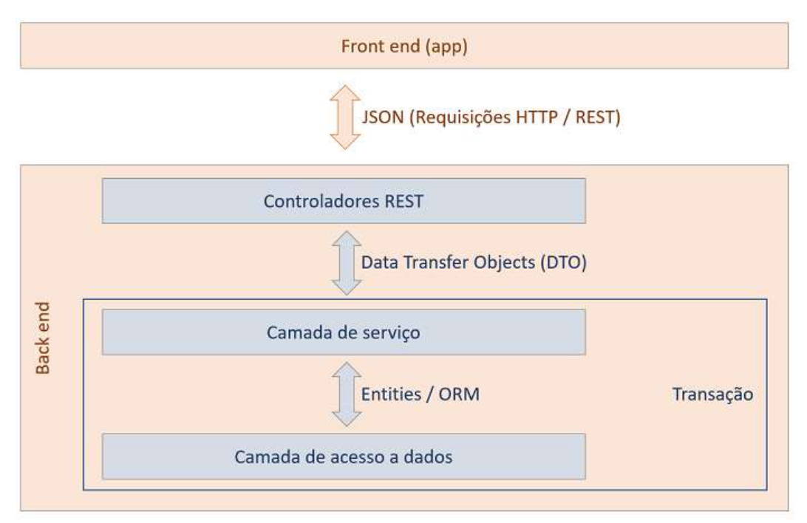
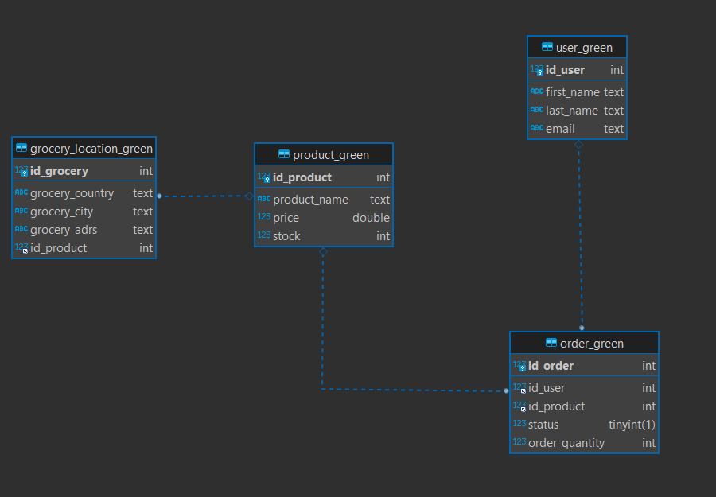

# projectdatagreen

Projeto Java com o padrão de projeto Model-Repository-Service-DTO-Controller

| Camada     | Função                                    | 
|------------|-------------------------------------------|
| CONTROLLER      | responsável por receber as requisições HTTP, interagir com o Service e retornar as respostas apropriadas |
| DTO        | transfere os dados entre a camada de Controller e a camada de Service. |
SERVICE | implementa a lógica de negócio da aplicação e faz uso dos métodos disponibilizados pelo Repository 
| REPOSITORY        | responsável pela persistência e recuperação dos dados do Model |
| MODEL        | representa a estrutura de dados do sistema 

### Lombok
Biblioteca para reduzir a verbosidade do código. A anotação @Data do Lombok ajuda a reduzir a verbosidade do código, gerando automaticamente os métodos getter, setter, equals, hashCode. É utilizado na camada Model. E na camada Controller com as anotações  @RestController, @RequestMapping, @GetMapping, @PostMapping, @PutMapping, @DeleteMapping.

### Modelo de entidade relacional

## Formatação de arquivo .md

- `src`: the folder to maintain sources
  [here](https://github.com/deisekinsk/condicionalJava).
> If you want to customize the folder structure, open `.vscode/settings.json` and update the related settings there.